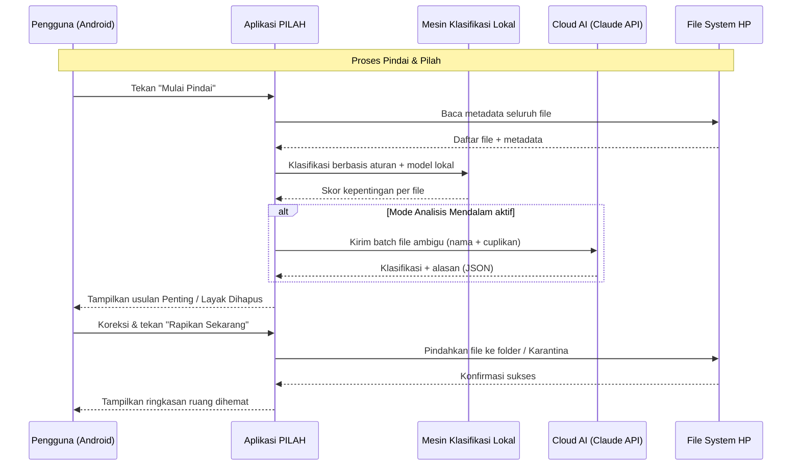
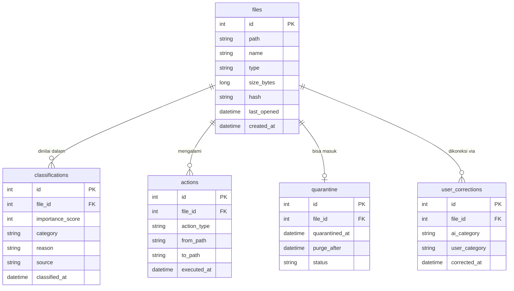

# PRD — PILAH: Asisten AI Pemilah File HP

> **Tagline:** *"Biar AI yang Beres-Beres."*

## 1. Overview
Penyimpanan HP pengguna Indonesia cepat penuh oleh file WhatsApp, screenshot, foto duplikat, APK lama, dan dokumen yang tidak jelas statusnya. File manager yang ada (Files by Google, FileMaster, dll) hanya mengelompokkan berdasarkan **aturan statis** (tipe file, ukuran, tanggal) — mereka tidak bisa menjawab pertanyaan utama pengguna: *"File mana yang penting, dan mana yang aman dihapus?"*

**PILAH** adalah aplikasi Android yang menggunakan kecerdasan buatan untuk **memindai, menilai, dan memilah** file di HP pengguna ke dalam dua kelompok besar — **Penting** dan **Layak Dihapus** — lalu merapikannya ke folder terstruktur secara otomatis, dengan persetujuan pengguna sebelum aksi apapun dijalankan.

Prinsip utama: **AI mengusulkan, pengguna memutuskan.** Tidak ada file yang dipindah atau dihapus tanpa konfirmasi.

## 2. Requirements
Berikut adalah persyaratan tingkat tinggi untuk pengembangan sistem:
- **Platform:** Aplikasi Android native (target awal), karena akses file system penuh dibutuhkan dan mayoritas pengguna target memakai Android.
- **Pengguna:** Individu pemilik HP (single user, tanpa login wajib di MVP).
- **Privasi:** Analisis dilakukan **on-device sebisa mungkin** (metadata, nama file, ukuran, usia, frekuensi akses). Konten file (isi dokumen/gambar) hanya dikirim ke cloud AI jika pengguna mengaktifkan mode "Analisis Mendalam" secara eksplisit.
- **Keamanan Data:** File yang ditandai "Layak Dihapus" masuk ke **Karantina** selama 30 hari sebelum terhapus permanen — bisa dipulihkan kapan saja.
- **Offline-first:** Pemindaian dan pemilahan berbasis aturan + model lokal tetap berfungsi tanpa internet; fitur AI cloud bersifat opsional.
- **Bahasa:** Antarmuka penuh dalam Bahasa Indonesia.

## 3. Core Features
Fitur-fitur kunci yang harus ada dalam versi pertama (MVP):

1.  **Pindai Cerdas (Smart Scan)**
    - Memindai seluruh penyimpanan internal + SD card.
    - Mengumpulkan metadata: tipe, ukuran, tanggal dibuat, terakhir dibuka, sumber (folder WhatsApp/Download/DCIM), dan hash untuk deteksi duplikat.
2.  **Klasifikasi AI (Penting vs Layak Dihapus)**
    - Skor kepentingan 0–100 per file berdasarkan sinyal: duplikat persis, screenshot lama, APK terinstal, file unduhan tak pernah dibuka, foto buram, dokumen bernama spesifik (ijazah, KTP, invoice).
    - **Mode Analisis Mendalam (opsional):** AI cloud (Claude Haiku untuk klasifikasi massal, Sonnet untuk dokumen ambigu) membaca nama file + cuplikan konten untuk menilai dokumen yang sulit, misalnya membedakan "draft skripsi final_FIX_2.docx" yang penting dari catatan sekali pakai.
3.  **Pilah Otomatis ke Folder (Auto-Foldering)**
    - Usulan struktur folder rapi: `Dokumen Penting/`, `Foto Kenangan/`, `Kerja & Bisnis/`, `Arsip/`, `Karantina/`.
    - Pengguna meninjau usulan dalam tampilan "Sebelum → Sesudah", lalu menyetujui sekali tap.
4.  **Karantina & Pembersihan Aman**
    - File "Layak Dihapus" dipindah ke Karantina, bukan langsung dihapus.
    - Ringkasan: "Kamu bisa hemat 4,2 GB" dengan rincian per kategori.
    - Penghapusan permanen otomatis setelah 30 hari, atau manual oleh pengguna.
5.  **Dashboard Penyimpanan**
    - Visualisasi ruang terpakai per kategori, riwayat pembersihan, dan total ruang yang berhasil dihemat sejak instalasi.

## 4. User Flow
Alur kerja sederhana bagi pengguna saat menggunakan aplikasi:

1.  **Onboarding:** Pengguna memberi izin akses penyimpanan dan memilih mode privasi (On-Device saja / + Analisis Mendalam).
2.  **Pindai:** Pengguna menekan "Mulai Pindai" — progres ditampilkan real-time (jumlah file, estimasi waktu).
3.  **Tinjau Hasil:** Aplikasi menampilkan dua tumpukan: **Penting** (dengan usulan folder tujuan) dan **Layak Dihapus** (dengan alasan per file, mis. "Duplikat dari IMG_2031.jpg").
4.  **Koreksi:** Pengguna bisa geser file antar kategori — koreksi ini menjadi sinyal pembelajaran preferensi lokal.
5.  **Eksekusi:** Pengguna menekan "Rapikan Sekarang" → file penting tertata ke folder, file tak penting masuk Karantina.
6.  **Verifikasi:** Dashboard menampilkan ruang yang dihemat dan struktur folder baru.

## 5. Architecture
Berikut adalah gambaran arsitektur sistem dan aliran data secara teknis namun sederhana:

## 6. Database Schema

Berikut adalah Entity Relationship Diagram (ERD) struktur database lokal (on-device):

| Tabel | Deskripsi |
|-------|-----------|
| **files** | Indeks metadata seluruh file hasil pemindaian |
| **classifications** | Hasil penilaian AI/lokal per file beserta skor dan alasan |
| **actions** | Log semua aksi pindah/hapus untuk audit dan undo |
| **quarantine** | File layak hapus yang menunggu 30 hari sebelum dihapus permanen |
| **user_corrections** | Koreksi pengguna sebagai sinyal pembelajaran preferensi lokal |

## 7. Design & Technical Constraints
Bagian ini mengatur batasan teknis dan panduan desain yang harus dipatuhi.

1.  **High-Level Technology:**
    Aplikasi dibangun dengan teknologi Android modern yang mendukung pengembangan cepat (mis. Kotlin + Jetpack Compose, database lokal SQLite/Room). Klasifikasi cloud memakai arsitektur multi-model hemat biaya: model ringan untuk klasifikasi massal, model menengah hanya untuk kasus ambigu. Pengembang bebas memilih tools selama performa pemindaian tetap cepat di HP kelas menengah-bawah (RAM 3–4 GB).

2.  **Prinsip Keamanan Mutlak:**
    - Tidak ada penghapusan permanen tanpa fase Karantina.
    - Tidak ada konten file yang keluar dari perangkat tanpa opt-in eksplisit.
    - Semua aksi tercatat di log `actions` dan bisa di-undo.

3.  **Typography Rules:**
    Sistem antarmuka (UI) wajib menggunakan konfigurasi font sebagai berikut untuk menjaga konsistensi visual:
    -   **Sans:** `Geist Mono, ui-monospace, monospace`
    -   **Serif:** `serif`
    -   **Mono:** `JetBrains Mono, monospace`

---

## Lampiran: Nama & Domain

**Nama terpilih: PILAH** — diambil langsung dari kata kerja "memilah", inti dari fungsi aplikasi. Pendek (5 huruf), mudah diucapkan, autentik Indonesia, dan konsisten dengan gaya penamaan produkmu yang lain (ZUANG, Rinjal).

**Kandidat domain (urutan prioritas):**
1. `pilah.app` — paling cocok untuk produk aplikasi
2. `pilah.id` — identitas Indonesia kuat
3. `pilahin.com` — fallback jika dua di atas sudah terdaftar
4. `getpilah.com` — fallback umum gaya startup

**Alternatif nama** jika PILAH terkendala merek: **BERESIN** (beresin.app) atau **RAPIIN** (rapiin.app).
